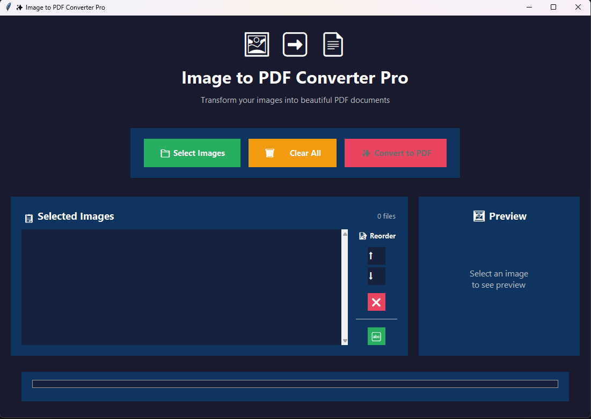

# 🖼️ Image to PDF Converter

A modern, user-friendly desktop application for converting multiple images into a single PDF document. Built with Python and Tkinter, featuring a beautiful dark theme interface with advanced image management capabilities.


## ✨ Features

### 🎨 **Modern Interface**
- **Dark theme** with professional styling
- **Card-based layout** for better organization
- **Hover effects** and smooth animations
- **Emoji icons** for intuitive navigation
- **Responsive design** that adapts to window resizing

### 📁 **Image Management**
- **Multi-image selection** with file dialog
- **Thumbnail preview** with image details (dimensions, file size)
- **Real-time preview** of selected images
- **Drag-and-drop support** for easy file addition
- **File format validation** with error handling

### 🔧 **Advanced Reordering**
- **Move up/down buttons** (⬆️⬇️) for precise page ordering
- **Remove individual images** (❌) without clearing entire selection
- **Alphabetical sorting** (🔤) for quick organization
- **Visual feedback** with position tracking (e.g., "3/10")
- **Smart selection** that follows moved items

### 📄 **PDF Generation**
- **High-quality PDF output** with preserved image quality
- **Progress tracking** with real-time status updates
- **Automatic file opening** option after conversion
- **Cross-platform PDF viewing** (Windows, macOS, Linux)
- **Error handling** with helpful messages

### 🛡️ **Privacy & Security**
- **100% offline processing** - no internet required
- **No file uploads** to external servers
- **Local-only operation** for maximum privacy
- **Open source** - fully auditable code

## 📸 Screenshots


*Modern Image to PDF Converter with dark theme, thumbnail preview, and advanced reordering controls*

## 🚀 Quick Start

### Prerequisites
- Python 3.7 or higher
- pip (Python package installer)

### Installation

1. **Clone the repository**
   ```bash
   git clone https://github.com/OST-Athar/image-to-pdf-converter.git
   cd image-to-pdf-converter
   ```

2. **Install dependencies**
   ```bash
   pip install -r requirements.txt
   ```

3. **Run the application**
   ```bash
   python main.py
   ```

### Alternative: Console-less Mode
For a cleaner experience without the command prompt window:
```bash
python run_gui.pyw
```
Or simply **double-click** `run_gui.pyw` in Windows Explorer.

### Alternative: Direct Download
1. Download the ZIP file from GitHub
2. Extract to your desired location
3. Install dependencies: `pip install -r requirements.txt`
4. Run: `python main.py`

## 🎯 How to Use

### Basic Workflow
1. **📁 Select Images** - Click "Select Images" to choose multiple image files
2. **👁️ Preview & Organize** - Click on images in the list to preview them
3. **📝 Reorder** - Use the control buttons to arrange images in your preferred order:
   - **⬆️** Move selected image up
   - **⬇️** Move selected image down  
   - **❌** Remove selected image
   - **🔤** Sort all images alphabetically
4. **✨ Convert** - Click "Convert to PDF" to generate your document
5. **📄 Open** - Choose to open the PDF immediately after creation

### Supported Formats
- **Input**: JPG, JPEG, PNG, BMP, GIF, TIFF, WEBP
- **Output**: PDF (high-quality, optimized)

### Tips for Best Results
- **Image Quality**: Higher resolution images produce better PDF quality
- **File Size**: Large images will create larger PDFs
- **Order**: Use the reordering tools to get pages in the perfect sequence
- **Organization**: The alphabetical sort is great for scanned documents

## 🛠️ Technical Details

### Built With
- **Python 3.7+** - Core programming language
- **Tkinter** - GUI framework (built into Python)
- **Pillow (PIL)** - Image processing library
- **Cross-platform** - Works on Windows, macOS, and Linux

### Architecture
- **Single-file application** for easy distribution
- **Modular design** with clear separation of concerns
- **Memory-efficient** thumbnail handling
- **Error-resilient** with comprehensive exception handling

### Performance
- **Fast processing** - Local conversion without network delays
- **Memory optimized** - Efficient handling of large image collections
- **Responsive UI** - Non-blocking operations with progress feedback

## 🤝 Contributing

Contributions are welcome! Here's how you can help:

1. **Fork the repository**
2. **Create a feature branch** (`git checkout -b feature/amazing-feature`)
3. **Commit your changes** (`git commit -m 'Add amazing feature'`)
4. **Push to the branch** (`git push origin feature/amazing-feature`)
5. **Open a Pull Request**

### Development Setup
```bash
git clone https://github.com/OST-Athar/image-to-pdf-converter.git
cd image-to-pdf-converter
pip install -r requirements.txt
python main.py
```

## 📝 License

This project is licensed under the MIT License - see the [LICENSE](LICENSE) file for details.

## 🙏 Acknowledgments

- **Pillow Team** - For the excellent image processing library
- **Python Community** - For the robust standard library
- **Open Source Community** - For inspiration and best practices

## 🐛 Issues & Support

- **Bug Reports**: [GitHub Issues](https://github.com/OST-Athar/image-to-pdf-converter/issues)
- **Feature Requests**: [GitHub Issues](https://github.com/OST-Athar/image-to-pdf-converter/issues)
- **Discussions**: [GitHub Discussions](https://github.com/OST-Athar/image-to-pdf-converter/discussions)

## 🌟 Why This Project?

In an era where online converters pose privacy risks and require internet connectivity, this tool provides:
- **Complete privacy** - your files never leave your computer
- **Reliability** - works offline, no service dependencies  
- **Speed** - local processing is often faster than uploads
- **Trust** - open source code you can audit and modify
- **Cost** - completely free with no usage limits

---

**Made with ❤️ for the open source community**
